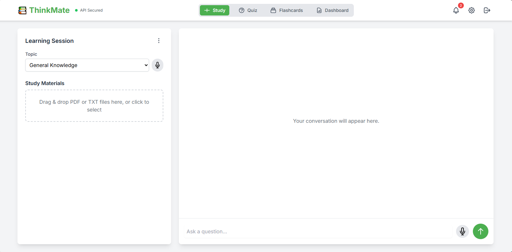

# ThinkMate-StudyBuddy

[](https://neo-cyphers.github.io/ThinkMate-StudyBuddy/ThinkMate_code/app.html)

**ThinkMate-StudyBuddy** is a versatile web-based learning platform designed to empower students and lifelong learners with personalized study tools. It offers a suite of features including customizable study sessions, interactive quizzes, flashcard creation, and a detailed dashboard to track progress. The application integrates advanced AI technologies to provide an adaptive learning experience, supporting a variety of topics and learning preferences.

## Interface Preview



> _Note: Place the image `301c498f-4e40-468d-aac8-de57249935df.png` into the `/assets` folder and rename it to `interface-preview.png`._

##  Table of Contents

- [Features](#features)
- [Installation](#installation)
- [Usage](#usage)
- [Technologies Used](#technologies-used)
- [Project Structure](#project-structure)
- [Contributing](#contributing)

##  Features

### Personalization Center (`settings.html`)

- Customize themes: Light, Dark, Blue, Green
- Choose AI personality: Professor, Mentor, Researcher, Coach
- Set learning preferences: visual explanations, real-world examples, technical terminology
- Select difficulty: Beginner to Expert
- Save/reset preferences

### Study Sessions (`app.html`)

- Upload study material (PDF/TXT)
- Select topics: General Knowledge, AI, History, Science, Math
- AI buddy assistance with voice input (speech-to-text)
- Save, download, and manage sessions
- Vector DB status tracking (e.g., 0 chunks)

### Quizzes (`quiz.html`)

- Custom quiz creation by topic, number, and difficulty
- Real-time score tracking and result review
- API key status refresh and fallback contact support
- Loading feedback: “Generating your custom quiz…”

### Flashcards (`flashcards.html`)

- Create decks by subject, number, difficulty
- Auto-flip, shuffle, and save progress
- Mark as “I Knew This” or “Needs Review”
- Metrics: Time spent, known/unknown cards
- Feedback: “Building your deck…”

### Dashboard (`dashboard.html`)

- Progress metrics: Overall, Concepts, History
- Manage notes, bookmarks, and materials
- View recent activity and continue sessions
- “Ask AI Buddy” button for real-time help

###  Speech-to-Text Support

- Voice input for hands-free topic selection and Q&A
- Integrated across study sessions

### Integration of 3+ AI Technologies

- **NLP:** For AI explanations and learning conversations  
- **Vision AI:** Extracts content/images from uploaded PDFs  
- **Speech Recognition:** Enables voice commands

### Language, AI & Data Integration

- Language AI for conversation
- Vision & speech AI for interaction
- Vector DB for persistent material storage

### User-Friendly UI

- Unified navigation bar across all pages
- Drag-and-drop interface, visual timers, and auto-progress tracking

### Persistent Storage & Fallbacks

- Saves user settings, decks, scores, and study history
- Graceful error handling and status prompts
- Secure API key management

## Installation

### 1. Clone the Repository

```bash
git clone https://github.com/yourusername/thinkmate.git
cd thinkmate
